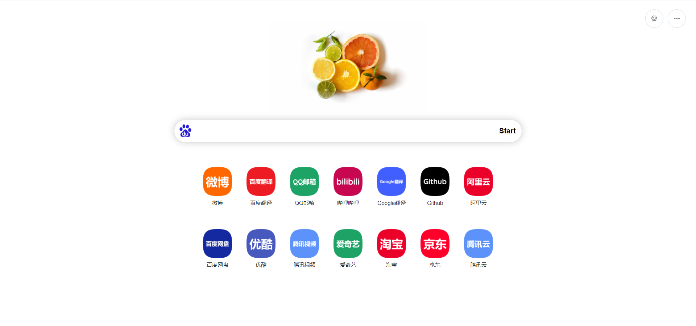
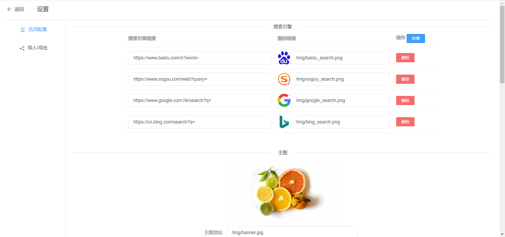
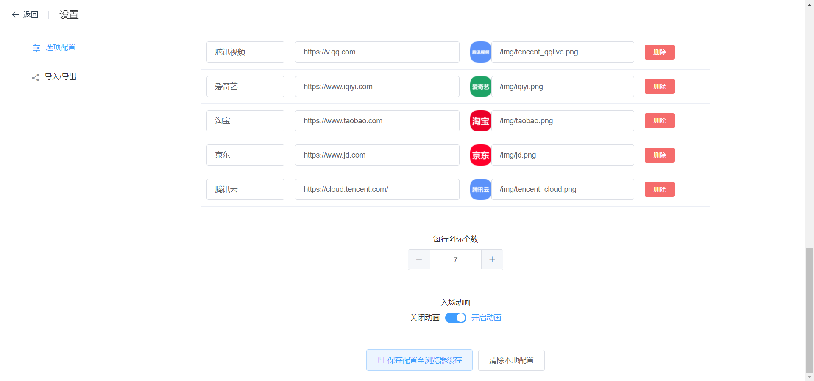
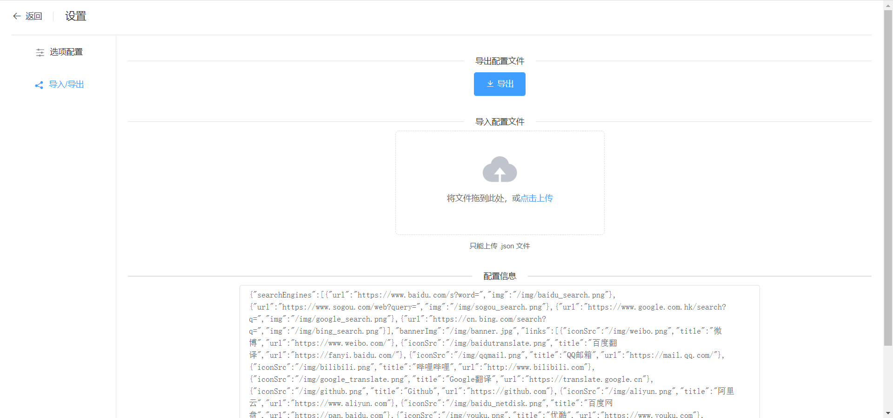

# HomePage

> 一个干净可自定义的主页（导航页）






## 界面

> 包含

- 主图
- 搜索栏
- 导航链接

## 设置

> 可自定义内容

- 主图
- 搜索引擎（含图标）
- 导航链接（含图标、链接、标题）
- 每行导航链接图标个数
- 入场动画

### 选项配置

在配置完配置项后点击`保存配置至浏览器缓存`即可完成自定义

`清除本地配置`可还原成默认配置

> 清理软件或浏览器清除浏览数据后可能导致配置丢失，还原成默认配置
>
> 建议完成自定义后下载配置文件到本地保存
>
> 可在`设置-导入/导出页面`进行操作

其中自定义各种图片/图标链接应填写图片的网络地址（以`https`/`http`开头）

## 项目开发配置

默认配置项位于`src/store/index.js`

默认图片位于`public/img`

默认网页图标位于`E:\vueproject\homepage\public\favicon.ico`


## 项目运行
```
npm install
```

### 为开发编译和热重载
```
npm run serve
```

### 为生产编译
```
npm run build
```
